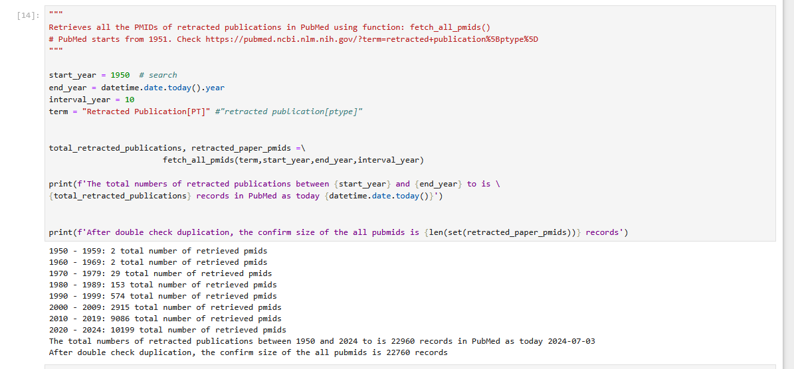
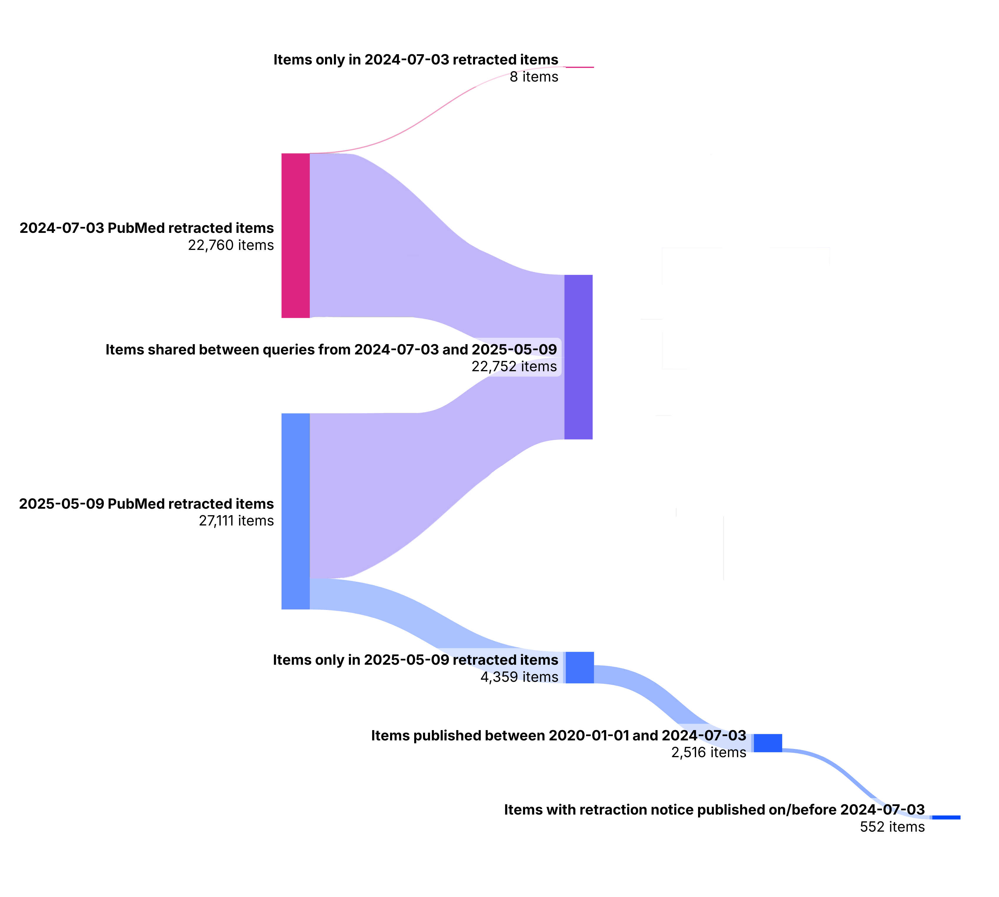

# Analysis to identify 199 PubMed items excluded from "Analyzing the consistency of retraction indexing" 
Created by Corinne McCumber and Malik Oyewale Salami

## Description
This repo shows the analysis completed to attempt to identify 199 PubMed items excluded from "Analyzing the consistency of retraction indexing". 

PubMed was queried on 2024-07-03 using the search term “Retracted Publication[PT]”. PubMed is only able to return 10,000 items when queried via the E-Utilities API. Documentation here: https://www.ncbi.nlm.nih.gov/books/NBK25499/#chapter4.ESearch "Increasing retmax allows more of the retrieved UIDs to be included in the XML output, up to a maximum of 10,000 records." 

When the pipeline was run 2024-07-03, the search focused between 2020 and 2024 returned 10,199 items, meaning that an expected 199 items indexed as retracted in PubMed were excluded. 



When we identified the bug in our retrieval process, we started attempting to identify those 199 missing items. We have narrowed down to 552 items (found in the PubMed query as of 2025-05-09) that possibly could have been missing from the 2024-07-03 query we use in the manuscript. 



## Citations
### Cite code as:
McCumber, C. & Salami, M.O. (2025). Analysis to identify 199 PubMed items excluded from "Analyzing the consistency of retraction indexing" (1.0.0) [Python]. GitHub. URL NEEDED

### Cite dataset as:
McCumber, C. & Salami, M. O. (2025). An attempt to identify 199 PubMed items excluded from "Analyzing the consistency of retraction indexing" (Version 1) [Data set]. University of Illinois Urbana-Champaign Databank. DOI forthcoming.

### Related article:
Salami, M. O., McCumber, C., & Schneider, J. (2024). Analyzing the consistency of retraction indexing. MetaArXiv. https://doi.org/10.31222/osf.io/gvfk5

## Setup

1. OS information: Windows 10 Version 22H2 (OS Build 19045.5737)
2. Required packages: listed in requirements.txt
3. Complete package dependencies are stored in environment.yml. 
This project was developed using the virtual environment described in environment.yml, which was created using Conda. 
[See here for virtual environment installation instructions.](https://docs.conda.io/projects/conda/en/latest/user-guide/tasks/manage-environments.html)
4. File structure: expected file structure is below. The ```/data/``` folder may need to be manually added when cloning this GitHub repo. Outputs will be saved in the ```/data/``` folder

```
├──retraction_indexing_missing_pubmed_items
|  ├──data
|  ├──python_scripts
|  |  ├──a_pubmed_data_collection.py
|  |  ├──b_create_initial_unionlist.py
|  |  ├──c_filter_and_clean_unionlist.py
|  |  └──d_additional_analysis.pt
|  ├──static
|  |  ├──error_in_original_run.png
|  |  ├──missing_pubmed_items_sankey.png
|  ├──environment.yml
|  ├──README.md
└──└──requirements.txt
```

## Usage
All referenced CSV files stored in dataset deposit, DOI forthcoming. Column descriptions also stored in dataset deposit.

For each script referenced below, variables can be changed via a ```main()``` function at the bottom of the Python file.

### 1. Acquire original 3 July 2024 data queried from PubMed

- File originally called ```pubmed_retractedpublication_2024-07-03.csv```. Renamed to ```2024-07-03_pubmed.csv``` for clarity

### 2. Use ```a_pubmed_data_collection.py``` to query PubMed for current retraction indexing information
    
- File called ```2025-05-09_pubmed.csv```

### 3. Merge data frames from ```2024-07-03_pubmed.csv``` and ```2025-05-09_pubmed.csv``` using ```b_create_initial_unionlist.py```
   
- File called ```1_2025-05-09_merged_df.csv```
- Outer merge on ```PubMedID``` column. 
- Contains all columns used in merge as well as ```Merge``` which indicates which source a row came from. 
- Where columns from the two sources share a name, 2024 PubMed columns have _x suffix, 2025 PubMed columns have _y suffix.

### 4. Filter full merged dataframe to remove duplicate information using ```b_create_initial_unionlist.py```

- File called ```2_2025-05-09_pubmed_unionlist.csv```

### 5. Filter for information only present in 2025 query using ```c_filter_and_clean_unionlist.py```

- File called ```3_2025-05-09_pubmed_unionlist_2025_only.csv```
- Same columns as previous ```2025-05-09_pubmed_unionlist.csv```
- Exclude items only present in 2024 query. 8 items total. These items indicate possible indexing improvement, but definitionally
would not be the 200 items missing from the 2024 query.
- Exclude items present in both 2024 and 2025 query. 22,752 items total. These items definitionally would not be the 200
items missing from the 2024 query. 
- Result is 4,359 items present only in the 2025 query.

### 6. Clean publication date information and filter for only publications published between 1 Jan 2020 and 3 Jul 2024 using ```c_filter_and_clean_unionlist.py```

- File called ```4_2025-05-09_pubmed_unionlist_pub_date_cleaned.csv``` and ```5_2025-05-09_pubmed_unionlist_pub_date_filtered.csv```
- Exclude items published before 1 Jan 2020 and after 3 July 2024; the original 2024 query was run on 3 July 2024 and limited to only get items published on or after 1 Jan 2020.
- Result is 2,516 items present only in the 2025 query and published between 1 Jan 2020 and 3 July 2024.

### 7. Clean retraction notice date information where available and filter for retraction notices published before 3 July 2024 using ```c_filter_and_clean_unionlist.py```
- File called ```6_2025-05-09_pubmed_unionlist_retraction_notice_cleaned.csv``` and ```7_2025-05-09_pubmed_unionlist_retraction_notice_filtered.csv```
- Not all retraction notices are indexed in PubMed; 2,280 retraction notices have PMIDs, 236 do not. For retraction notices without PMIDs, date information was unavailable. Typically, if there was no retraction notice PMID, the retraction notice citation was only a DOI value. 
- 1-1-1678 used as sentinel value if date was unavailable from PubMed information. 1677 is the minimum year that a pandas datetime object can contain.
- 1 also used to fill month and day information if those were missing from PubMed citation or if they were listed as '99'.

Result is 552 items that are:
1. present only in the 2025 query
2. published between 1 Jan 2020 and 3 July 2024
3. have retraction notices with either no retraction notice publication date (sentinel value of 1-1-1678) or a retraction notice publication date before 3 July 2024

### 8. Complete additional analysis using ```d_additional_analysis.py```
- Some functions require existing, proprietary information used in "Analyzing the consistency of retraction indexing".